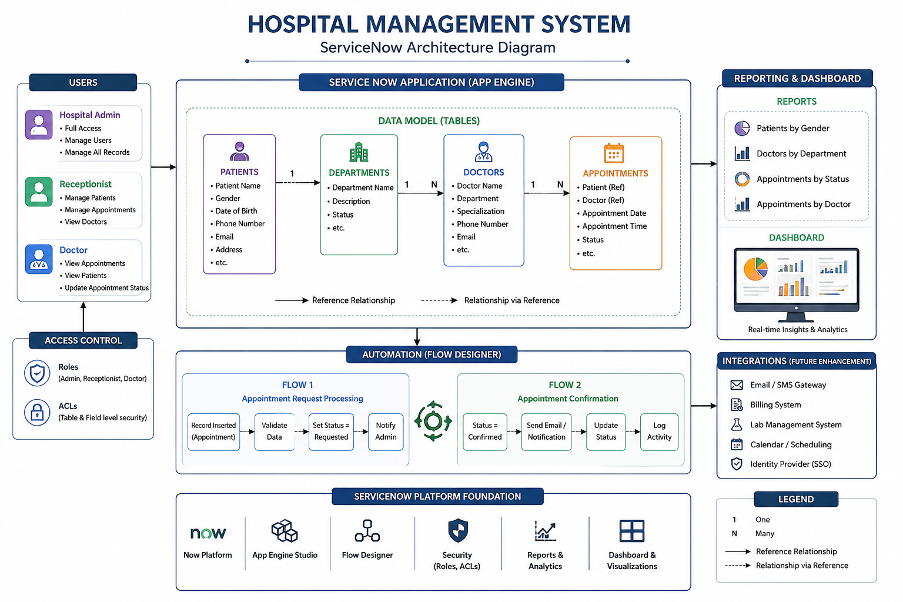

# 🏥 Hospital Management System - ServiceNow

> A custom Hospital Management System built using **ServiceNow App Engine** to automate hospital operations through low-code development, workflow automation, reporting, and role-based access control.


---

# 📌 Project Overview

The **Hospital Management System** is a ServiceNow-based enterprise application developed to streamline hospital administration by managing patients, doctors, departments, and appointments in a centralized platform.

This project demonstrates the use of ServiceNow's low-code capabilities including **App Engine Studio**, **Flow Designer**, **Reports**, **Dashboards**, **Roles**, and **Access Control Lists (ACLs)**.

---

# 🎯 Objectives

- Digitize hospital management processes
- Maintain patient records
- Manage doctor and department information
- Schedule appointments efficiently
- Automate appointment workflows
- Provide dashboards for monitoring hospital operations
- Secure data using role-based access control

---

# ✨ Features

- 👤 Patient Management
- 👨‍⚕️ Doctor Management
- 🏥 Department Management
- 📅 Appointment Scheduling
- 🔄 Workflow Automation using Flow Designer
- 📊 Reports & Analytics
- 📈 Interactive Dashboard
- 🔐 Roles & ACLs
- 🔗 Reference Relationships Between Tables

---

# 🏗️ System Architecture



---

# 🗄️ Database Design

The application consists of four primary tables:

| Table | Description |
|--------|-------------|
| Patients | Stores patient information |
| Doctors | Stores doctor details |
| Departments | Stores department details |
| Appointments | Stores appointment records |

### Relationships

- Department ➜ Doctors
- Patient ➜ Appointments
- Doctor ➜ Appointments

---

# ⚙️ Workflow Automation

## Flow 1 – Appointment Request Processing

Automatically processes newly created appointments.

### Steps

- Trigger on Appointment Creation
- Validate Record
- Update Appointment Status
- Notify Users

---

## Flow 2 – Appointment Confirmation

Automatically sends confirmation email after appointment approval.

### Steps

- Trigger on Status Change
- Send Email Notification

---

# 🔐 Security

Implemented Role-Based Access Control using:

- Hospital Admin
- Doctor
- Receptionist

ACLs were configured to control:

- Read
- Create
- Write
- Delete

permissions for each role.

---

# 📊 Reports

The following reports were created:

- Patients by Gender
- Doctors by Department
- Appointments by Status
- Appointments by Doctor

---

# 📈 Dashboard

The dashboard provides a quick overview of:

- Total Patients
- Total Doctors
- Department Statistics
- Appointment Analytics

---

# 🛠️ Technologies Used

| Technology | Purpose |
|------------|---------|
| ServiceNow | Application Platform |
| App Engine Studio | Low-Code Development |
| Flow Designer | Workflow Automation |
| Reports | Data Analytics |
| Dashboards | Visualization |
| ACLs | Security |
| Roles | User Authorization |

---

# 📂 Repository Structure

```
Hospital-Management-System-ServiceNow
│
├── README.md
├── Hospital_Management_System_Update_Set.xml
└── Screenshots
    ├── Home.png
    ├── Patients.png
    ├── Doctors.png
    ├── Departments.png
    ├── Appointments.png
    ├── Flow1.png
    ├── Flow2.png
    ├── Reports.png
    ├── Dashboard.png
    └── Architecture.png
```

---

# 🚀 Future Enhancements

- Patient Portal
- Billing Module
- Laboratory Management
- Pharmacy Module
- Bed Allocation
- SMS Notifications
- Email Reminders
- Doctor Availability Calendar

---

# 📷 Project Screenshots

## Application Home

*(Add Screenshot)*

---

## Patients

*(Add Screenshot)*

---

## Doctors

*(Add Screenshot)*

---

## Departments

*(Add Screenshot)*

---

## Appointments

*(Add Screenshot)*

---

## Flow Designer

*(Add Screenshot)*

---

## Dashboard

*(Add Screenshot)*

---

# 📄 Exported Application

This repository includes the exported ServiceNow Update Set:

**Hospital_Management_System_Update_Set.xml**

---

# 👩‍💻 Developed By

**Kasiyamini**

ServiceNow Certified System Administrator (CSA)

ServiceNow Certified Application Developer (CAD)

---

# ⭐ Acknowledgement

This project was developed for academic learning and to demonstrate ServiceNow application development using App Engine Studio and Flow Designer.

If you found this project helpful, consider giving the repository a ⭐.
